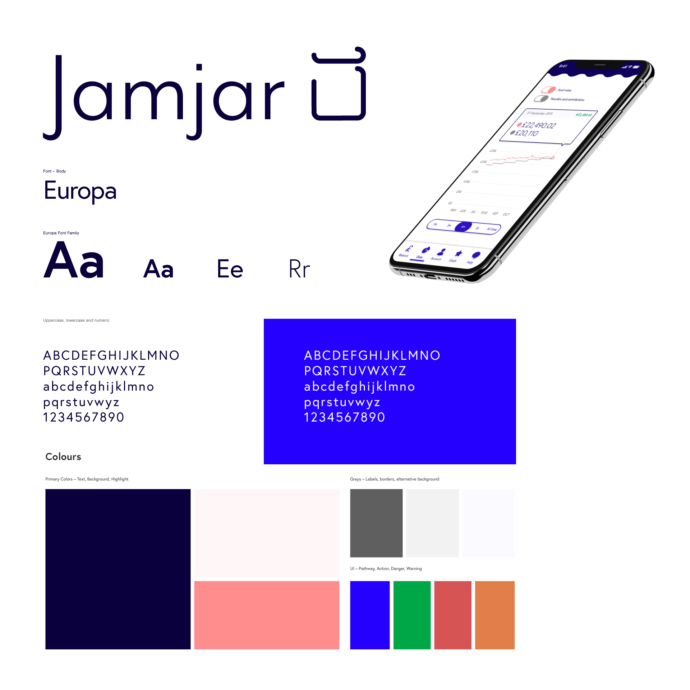
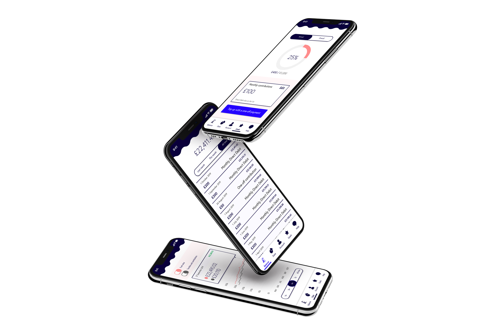

## About this project

Emergent fintech app, Jamjar, approached me to create designs for their app and accompanying website. Together we created an early-stages design system with the makings of a pattern library to cover their MVP as well as branding guidelines.

Once development of the brand and pattern library had passed exploration and testing stages, we commenced development of a simple website to act as a sales-funnel. The website was developed using Gatsby.js and Netlify for speed, security, and ease of collaboration.

