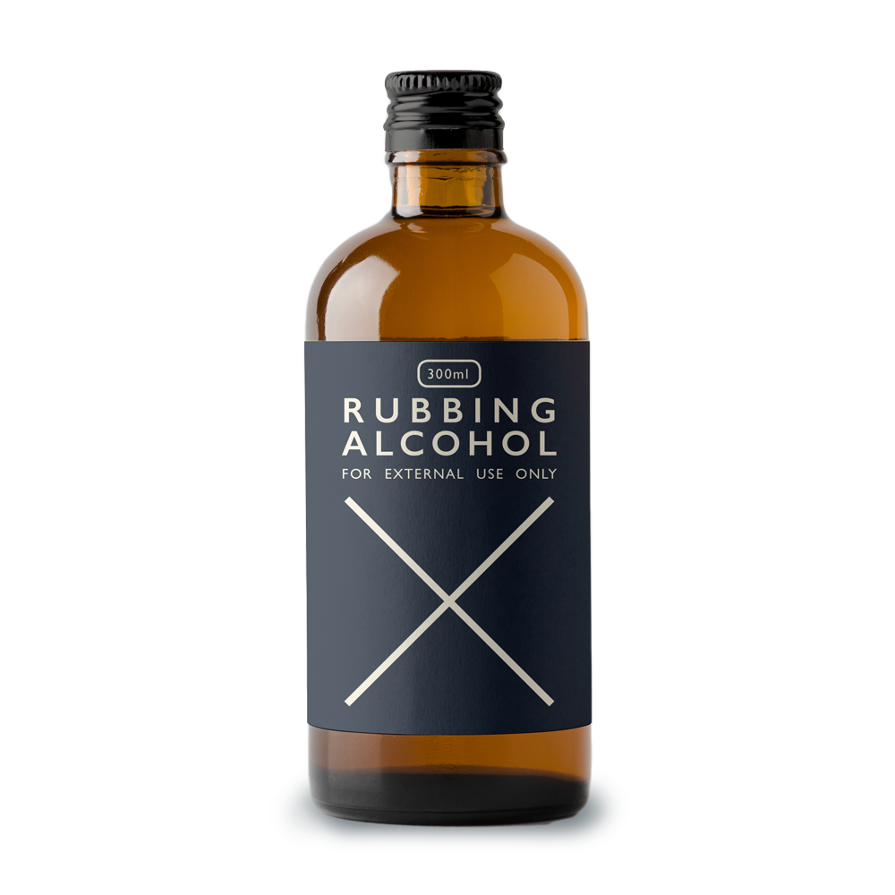
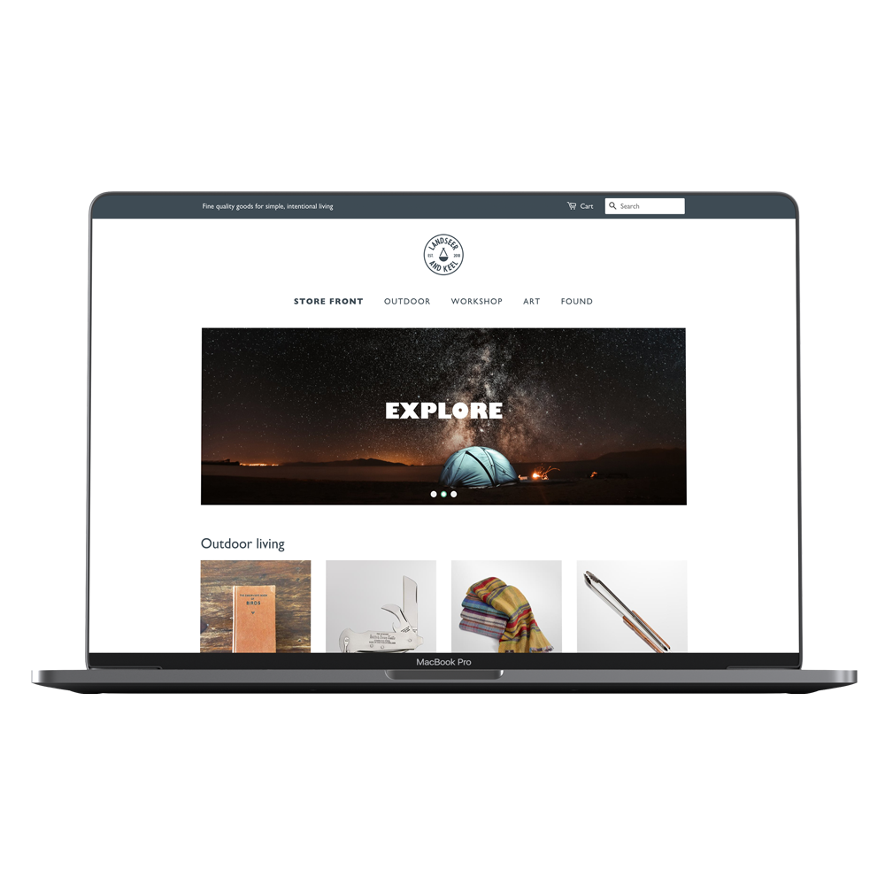

## About this project

Landseer and Keel's vision is to provide sustainable tools, homeware, and outdoor kit with a focus on utility and durability.

To reflect this, we worked together to create a brand that would stand the test of time much like the shop's products. By utilising natural hues and combining them with strong yet warm imagery we really connected with the brand's values of environmentalism and mental wellbeing.

