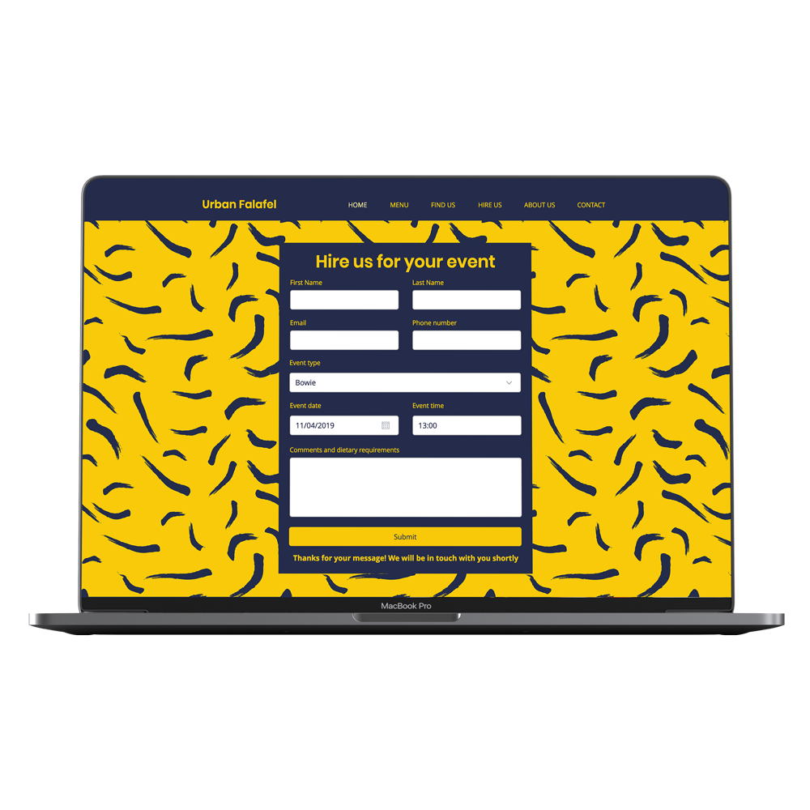
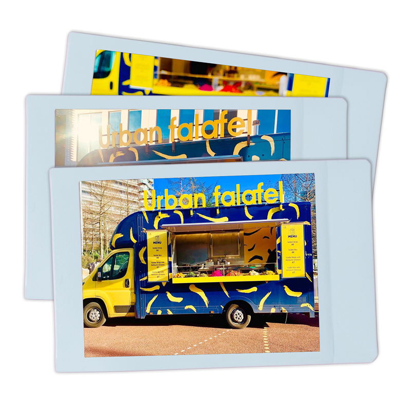

## About this project

Urban Falafel is a street food vendor based in London that sells delicious vegan salads and wraps. We were approached because the owner was having trouble getting spots and entering competitions without a website. They also wanted to move out of the marquee and into a brand new food truck.

At the onset we knew we wanted a look that was fresh and bold, that stood out from the crowd. Using an existing colour scheme we created a design that could be applied to the food truck to appeal to the desired audience as well as to the website and marketing materials for maximum effect.

